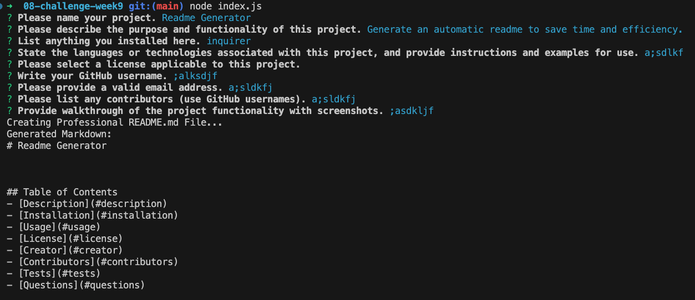
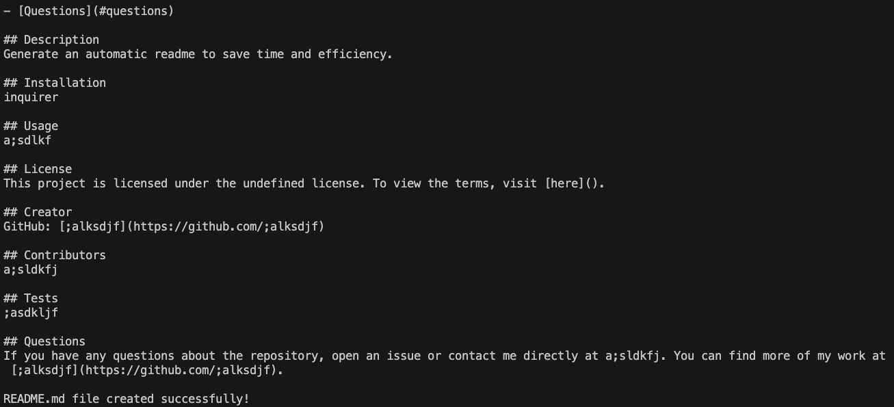
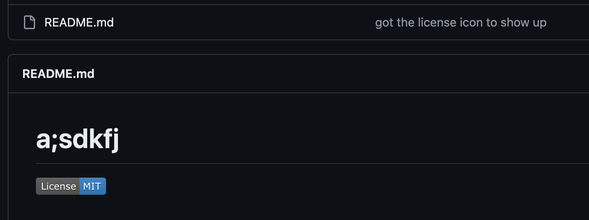

# README Generator

The purpose of this challenge was to use node.js to create a professional README Generator.

It should include what the app is for, how to use the app, how to install it, report issues, and make contributions.

We needed to create a command-line app that dynnamically generates a professional README.md file using the inquirer package. 

These were some of my sources I used to follow the project: https://www.youtube.com/watch?v=9YivEQFpmHQ&t=3s&ab_channel=DopeDev

I began by making the questions and array in the index.js file, then using the generate markdown js that generates it.

Here are some example screenshots of running node index.js

And you can see the screenshot of a successfully generated readme here:

And you can see the screenshot of a successful license icon function:

In conclusion, I:
- GIVEN a command-lne application that accepts user input 
- WHEN I'm prompted for info about my app repo
- Then,  a high-quality professional README.md is generated with the title of my project and sections including description, table of content, installation, usage, license, contributing, tests, and questions
- The project title is entered and displayed as the title of the README
- the description, installation instruction, usage, contribution guidelines, and test instruction info is added to the likened sections of the readme
- you can then choose a license for the app from a list of options
- you can enter your github user and email 

Here is a link to the video walkthru: https://vimeo.com/user56387053 